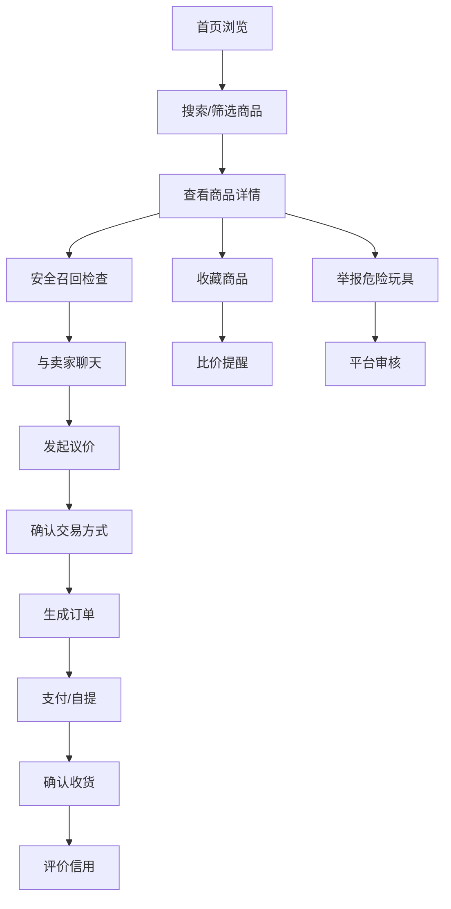

## 1. 产品概述

童乐汇 - 面向家长的二手玩具交易平台，致力于让闲置玩具流动起来，为家庭节省开支同时减少资源浪费。平台注重玩具安全、卫生与信任，提供消毒认证、安全召回提示、信用评价等保障机制。

- 核心价值：安全、放心、省钱的二手玩具交易体验
- 目标用户：有 0-12 岁孩子的家长群体
- 市场定位：专注于玩具品类的垂直二手交易平台

## 2. 核心功能

### 2.1 用户角色

| 角色 | 注册方式 | 核心权限 |
|------|---------|---------|
| 买家/卖家 | 手机号注册 | 发布商品、浏览搜索、聊天议价、下单交易、评价信用 |
| 平台管理员 | 后台登录 | 审核商品、处理举报、仲裁纠纷、管理召回信息 |

### 2.2 功能模块

1. **首页推荐**：精选推荐、分类入口、搜索框、附近面交点、安全提示
2. **分类搜索**：多维度筛选（年龄段、品类、成色、价格、距离）、商品列表、排序切换
3. **商品详情**：多图轮播、消毒说明、配件清单、瑕疵标注、安全召回提示、收藏比价、卖家信息
4. **发布编辑**：商品信息填写、多图上传、配件清单、瑕疵标注、自动安全召回提示、消毒承诺
5. **聊天议价**：站内聊天、发起议价、接受/拒绝议价、交易约定
6. **订单管理**：订单列表、订单详情、物流跟踪、确认收货、申请退款、评价晒单
7. **个人中心**：个人信息、我的收藏、我的发布、家庭玩具愿望单、信用评价、设置
8. **举报仲裁**：举报危险玩具、仲裁申请、处理进度、平台规则

### 2.3 页面详情

| 页面名称 | 模块名称 | 功能描述 |
|---------|---------|---------|
| 首页推荐 | 顶部导航 | Logo、搜索框、发布按钮、消息、个人中心入口 |
| 首页推荐 | 精选推荐 | 轮播 Banner、热门分类快捷入口 |
| 首页推荐 | 推荐商品流 | 智能推荐、新品上架、附近好物 |
| 首页推荐 | 安全专区 | 安全召回公告、消毒认证说明、平台保障 |
| 分类搜索 | 筛选栏 | 年龄段、品类、成色、价格区间、距离筛选 |
| 分类搜索 | 排序切换 | 综合、最新、价格、距离排序 |
| 分类搜索 | 商品列表 | 卡片式商品展示、价格、成色、距离标签 |
| 商品详情 | 图片展示 | 多图轮播、放大查看、消毒认证标识 |
| 商品详情 | 商品信息 | 标题、价格、成色、年龄段、品类、所在地 |
| 商品详情 | 详细描述 | 商品描述、配件清单、瑕疵标注、消毒说明 |
| 商品详情 | 安全提示 | 安全召回风险提示、适龄提醒 |
| 商品详情 | 卖家信息 | 卖家头像、昵称、信用分、在售商品数 |
| 商品详情 | 操作区 | 收藏、聊一聊、立即购买、议价 |
| 发布编辑 | 基本信息 | 标题、品类、年龄段、成色、价格、所在地 |
| 发布编辑 | 图片上传 | 多图上传、主图设置、图片顺序调整 |
| 发布编辑 | 详细描述 | 商品描述、配件清单、瑕疵标注 |
| 发布编辑 | 安全检查 | 自动安全召回提示、消毒承诺、安全声明 |
| 聊天议价 | 聊天列表 | 最近聊天、未读消息、商品关联 |
| 聊天议价 | 聊天窗口 | 消息发送、图片发送、议价卡片、交易约定 |
| 聊天议价 | 议价功能 | 发起议价、接受议价、拒绝议价、议价记录 |
| 订单管理 | 订单列表 | 全部订单、待付款、待发货、待收货、已完成、退款中 |
| 订单管理 | 订单详情 | 订单信息、商品信息、物流跟踪、交易双方信息 |
| 订单管理 | 订单操作 | 确认收货、申请退款、评价、联系卖家 |
| 个人中心 | 用户信息 | 头像、昵称、信用分、评价数 |
| 个人中心 | 功能入口 | 我的发布、我的收藏、我的订单、愿望单、消息通知 |
| 个人中心 | 家庭愿望单 | 玩具愿望清单、添加愿望、匹配提醒 |
| 个人中心 | 信用评价 | 信用分数、评价列表、交易统计 |
| 举报仲裁 | 举报入口 | 举报危险玩具、举报违规行为、选择举报类型 |
| 举报仲裁 | 仲裁申请 | 申请交易仲裁、上传证据、描述问题 |
| 举报仲裁 | 处理进度 | 举报/仲裁记录、处理状态、平台回复 |
| 举报仲裁 | 平台规则 | 交易规则、安全标准、处罚说明 |

## 3. 核心流程

### 3.1 浏览购买流程
用户进入首页 → 浏览推荐或搜索筛选 → 查看商品详情 → 确认商品信息与安全提示 → 与卖家聊天议价 → 下单（自提/邮寄）→ 支付 → 收货确认 → 评价

### 3.2 发布售卖流程
用户点击发布 → 填写商品基本信息 → 上传图片 → 填写配件清单与瑕疵标注 → 系统自动检测安全召回 → 确认消毒承诺 → 提交发布 → 等待买家咨询 → 议价成交 → 发货/自提 → 收款评价

### 3.3 举报仲裁流程
发现问题玩具/交易纠纷 → 进入举报仲裁页面 → 选择举报/仲裁类型 → 填写详情并上传证据 → 提交申请 → 平台审核处理 → 查看处理进度 → 收到处理结果

## 4. 用户界面设计

### 4.1 设计风格

**设计理念**：童趣温馨 + 安全可信

- **主色调**：温暖橙黄色 (#FF8C42) - 代表活力、温暖、童趣
- **辅助色**：清新薄荷绿 (#4ECDC4) - 代表安全、卫生、信任
- **点缀色**：柔和天空蓝 (#45B7D1) - 代表纯净、希望
- **中性色**：米白色背景 (#FFF8F0)、深灰文字 (#2D3436)、浅灰边框 (#E0E0E0)
- **按钮风格**：圆角胶囊形按钮，主按钮有柔和阴影，悬停有微放大效果
- **字体**：
  - 标题：圆润可爱的 display 字体（如 Zen Maru Gothic / 站酷快乐体）
  - 正文：清晰易读的无衬线字体（如 PingFang SC / Noto Sans SC）
- **布局风格**：卡片式布局，柔和圆角，轻盈阴影，大量留白
- **图标风格**：填充式圆角图标，色彩丰富，带有童趣感
- **装饰元素**：玩具积木图案点缀、柔和波浪分隔线、彩虹渐变元素

### 4.2 页面设计概览

| 页面名称 | 模块名称 | UI 元素 |
|---------|---------|---------|
| 首页推荐 | 顶部导航 | 渐变背景、圆角搜索框、悬浮发布按钮 |
| 首页推荐 | 分类入口 | 彩色图标卡片、hover 上浮动画 |
| 首页推荐 | 商品流 | 双列瀑布流、圆角卡片、成色标签、价格突出显示 |
| 分类搜索 | 筛选栏 | 横向滚动标签、筛选抽屉、价格滑块 |
| 分类搜索 | 商品卡片 | 主图+标签、标题两行截断、卖家信息简示 |
| 商品详情 | 图片区 | 全屏轮播、指示点、消毒认证徽章 |
| 商品详情 | 信息区 | 价格大号显示、成色/年龄段标签、安全提示横幅 |
| 商品详情 | 卖家区 | 头像圆形边框、信用分展示、进入店铺按钮 |
| 商品详情 | 底部操作栏 | 收藏按钮、聊一聊、立即购买（固定底部） |
| 发布编辑 | 表单区 | 分组卡片式表单、上传图片网格、标签选择器 |
| 发布编辑 | 安全区 | 黄色警告卡片、召回信息、勾选确认 |
| 聊天议价 | 聊天列表 | 头像+商品预览+最后消息+未读角标 |
| 聊天议价 | 聊天窗口 | 气泡式消息、议价卡片悬浮、底部输入栏 |
| 订单管理 | 订单列表 | 订单状态标签、商品缩略图、操作按钮组 |
| 订单管理 | 物流跟踪 | 时间轴样式、物流节点高亮 |
| 个人中心 | 头部 | 弧形渐变背景、头像、信用分展示 |
| 个人中心 | 功能区 | 宫格布局、彩色图标、数字角标 |
| 个人中心 | 愿望单 | 卡片堆叠、添加按钮、匹配提示 |
| 举报仲裁 | 举报表单 | 类型选择卡片、描述输入、证据上传 |
| 举报仲裁 | 进度查询 | 状态时间轴、平台回复区域 |

### 4.3 响应式设计

- **设计原则**：桌面优先，移动端适配
- **断点设置**：
  - 桌面端：≥ 1200px（主内容区 1140px）
  - 平板端：768px - 1199px（双列布局）
  - 移动端：< 768px（单列布局，底部导航）
- **触摸优化**：移动端按钮尺寸 ≥ 44px，手势滑动支持，双击缩放禁用
- **导航适配**：桌面端顶部导航 + 侧边分类；移动端底部 Tab 栏 + 汉堡菜单

### 4.4 动效与交互

- **页面切换**：淡入淡出 + 轻微位移
- **卡片悬停**：轻微上浮 + 阴影加深
- **按钮交互**：点击缩放反馈 + 涟漪效果
- **图片加载**：模糊占位 → 清晰渐入
- **列表滚动**：骨架屏占位、下拉刷新、上拉加载
- **收藏/点赞**：心形缩放弹跳动画
- **议价动效**：价格数字跳动变化
