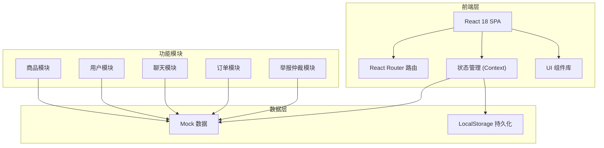
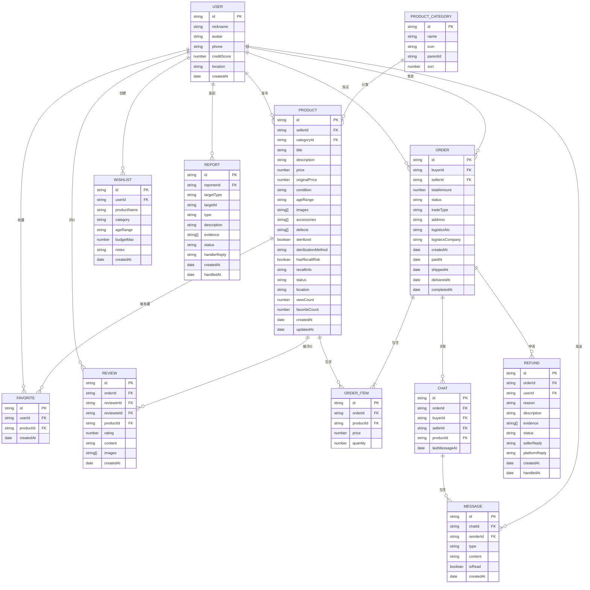

## 1. 架构设计



## 2. 技术描述

### 2.1 技术栈

- **前端框架**：React 18 + TypeScript
- **构建工具**：Vite 5
- **样式方案**：TailwindCSS 3
- **路由管理**：React Router v6
- **状态管理**：React Context + useReducer
- **图标库**：Lucide React
- **数据模拟**：Mock 数据 + LocalStorage 持久化

### 2.2 技术选型说明

1. **React + TypeScript**：保证代码质量和可维护性，适合中型应用开发
2. **Vite**：开发体验好，热更新快，构建性能优异
3. **TailwindCSS**：快速开发，一致性高，响应式方便
4. **React Router v6**：官方推荐路由方案，功能完善
5. **Context + useReducer**：轻量级状态管理，避免过度设计
6. **Lucide React**：轻量图标库，风格统一
7. **Mock + LocalStorage**：无需后端即可完整体验，数据可持久化

## 3. 路由定义

| 路由路径 | 页面名称 | 说明 |
|---------|---------|------|
| `/` | 首页推荐 | 精选推荐、分类入口、推荐商品流 |
| `/search` | 分类搜索 | 多维度筛选、商品列表、排序 |
| `/product/:id` | 商品详情 | 商品信息、多图、安全提示、卖家信息 |
| `/publish` | 发布商品 | 发布新商品表单 |
| `/publish/:id` | 编辑商品 | 编辑已有商品 |
| `/chat` | 聊天列表 | 最近聊天列表 |
| `/chat/:id` | 聊天详情 | 与指定卖家/买家聊天 |
| `/orders` | 订单管理 | 订单列表、状态筛选 |
| `/orders/:id` | 订单详情 | 订单详情、物流跟踪 |
| `/profile` | 个人中心 | 用户信息、功能入口 |
| `/profile/favorites` | 我的收藏 | 收藏商品列表 |
| `/profile/listings` | 我的发布 | 发布的商品管理 |
| `/profile/wishlist` | 玩具愿望单 | 家庭玩具愿望清单 |
| `/report` | 举报仲裁 | 举报入口、仲裁申请 |
| `/report/progress` | 处理进度 | 举报/仲裁处理进度 |
| `*` | 404 页面 | 未找到页面 |

## 4. 目录结构

```
src/
├── assets/              # 静态资源
│   ├── images/          # 图片资源
│   └── styles/          # 全局样式
├── components/          # 公共组件
│   ├── ui/              # UI 基础组件 (Button, Card, Modal...)
│   ├── layout/          # 布局组件 (Header, Footer, Sidebar...)
│   └── business/        # 业务组件 (ProductCard, FilterBar...)
├── pages/               # 页面组件
│   ├── Home/            # 首页
│   ├── Search/          # 搜索页
│   ├── ProductDetail/   # 商品详情
│   ├── Publish/         # 发布编辑
│   ├── Chat/            # 聊天议价
│   ├── Orders/          # 订单管理
│   ├── Profile/         # 个人中心
│   └── Report/          # 举报仲裁
├── context/             # 状态管理
│   ├── UserContext.tsx
│   ├── ProductContext.tsx
│   ├── ChatContext.tsx
│   └── OrderContext.tsx
├── data/                # Mock 数据
│   ├── products.ts
│   ├── users.ts
│   ├── chats.ts
│   ├── orders.ts
│   └── categories.ts
├── types/               # TypeScript 类型定义
│   ├── product.ts
│   ├── user.ts
│   ├── chat.ts
│   ├── order.ts
│   └── index.ts
├── utils/               # 工具函数
│   ├── format.ts
│   ├── storage.ts
│   └── validation.ts
├── hooks/               # 自定义 Hooks
│   ├── useDebounce.ts
│   ├── useLocalStorage.ts
│   └── usePagination.ts
├── App.tsx              # 根组件
├── main.tsx             # 入口文件
└── index.css            # 全局样式
```

## 5. 数据模型

### 5.1 数据模型 ER 图



### 5.2 核心数据类型定义

```typescript
// 用户类型
interface User {
  id: string;
  nickname: string;
  avatar: string;
  phone: string;
  creditScore: number;
  location: string;
  bio: string;
  totalSales: number;
  totalPurchases: number;
  createdAt: string;
}

// 商品类型
interface Product {
  id: string;
  sellerId: string;
  categoryId: string;
  title: string;
  description: string;
  price: number;
  originalPrice: number;
  condition: 'new' | 'like_new' | 'good' | 'fair' | 'poor';
  ageRange: string;
  images: string[];
  accessories: string[];
  defects: string[];
  sterilized: boolean;
  sterilizationMethod: string;
  hasRecallRisk: boolean;
  recallInfo?: string;
  status: 'active' | 'sold' | 'offline' | 'reported';
  location: string;
  distance?: number;
  viewCount: number;
  favoriteCount: number;
  createdAt: string;
  updatedAt: string;
}

// 订单类型
interface Order {
  id: string;
  buyerId: string;
  sellerId: string;
  productId: string;
  productSnapshot: Product;
  price: number;
  status: 'pending_payment' | 'pending_shipment' | 'shipped' | 'delivered' | 'completed' | 'cancelled' | 'refunding' | 'refunded';
  tradeType: 'pickup' | 'shipping';
  address?: {
    name: string;
    phone: string;
    detail: string;
  };
  logistics?: {
    company: string;
    trackingNo: string;
    updates: { time: string; status: string; location?: string }[];
  };
  negotiatedPrice?: number;
  createdAt: string;
  paidAt?: string;
  shippedAt?: string;
  deliveredAt?: string;
  completedAt?: string;
}

// 聊天类型
interface Chat {
  id: string;
  participantIds: string[];
  productId: string;
  orderId?: string;
  lastMessage: Message | null;
  unreadCount: number;
  updatedAt: string;
}

interface Message {
  id: string;
  chatId: string;
  senderId: string;
  type: 'text' | 'image' | 'offer' | 'system';
  content: string;
  offerPrice?: number;
  offerStatus?: 'pending' | 'accepted' | 'rejected';
  isRead: boolean;
  createdAt: string;
}

// 举报仲裁类型
interface Report {
  id: string;
  reporterId: string;
  targetType: 'product' | 'user' | 'order';
  targetId: string;
  type: string;
  description: string;
  evidence: string[];
  status: 'pending' | 'processing' | 'resolved' | 'rejected';
  handlerReply?: string;
  createdAt: string;
  handledAt?: string;
}
```

## 6. 核心功能实现方案

### 6.1 筛选功能
- 基于多条件组合筛选：年龄段、品类、成色、价格区间、距离
- 使用 useMemo 优化筛选性能
- 支持筛选条件持久化到 URL 参数

### 6.2 安全召回检测
- 维护召回玩具黑名单数据库
- 发布商品时根据关键词自动匹配
- 商品详情页醒目提示召回风险

### 6.3 聊天议价
- 模拟实时聊天效果（setInterval 轮询）
- 议价消息特殊样式展示
- 接受议价后自动更新订单价格

### 6.4 订单状态流转
- 订单状态机：待付款 → 待发货 → 已发货 → 待收货 → 已完成
- 退款状态：申请中 → 处理中 → 已退款/已拒绝
- 每个状态对应可执行操作

### 6.5 本地持久化
- 使用 LocalStorage 存储用户数据、收藏、购物车
- 页面刷新后数据不丢失
- 定期清理过期数据
